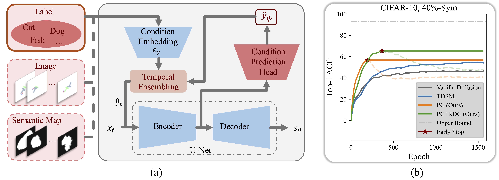

# Robust Learning of Diffusion Models with Extremely Noisy Conditions

**Xin Chen<sup>1</sup>, Gillian Dobbie<sup>1</sup>, Xinyu Wang<sup>2</sup>, Feng Liu<sup>3</sup>, Di Wang<sup>4</sup>, Jingfeng Zhang<sup>1,4,†</sup>**

<sup>1</sup> University of Auckland,  
<sup>2</sup> Shandong University,   
<sup>3</sup> University of Melbourne,  
<sup>4</sup> King Abdullah University of Science and Technology,  
<small>† Corresponding author: jingfeng.zhang@auckland.ac.nz</small>  


\[[Paper](https://arxiv.org/pdf/2510.10149)\]        \[[Project Page](https://robustdiffusionpolicy.github.io/)\]

<br>

> 
*(a) Structures of our robust diffusion model: a lightweight prediction head that predicts pseudo conditions $\hat{y}$ is added at the output of the U-Net encoder of the diffusion model, and temporal ensembling is then adopted to update pseudo conditions. (b) Learning dynamics of conditional diffusion models on CIFAR-10 under $40\%$ symmetric noise. Y-axis: controllability (Top-1 ACC of generated images, 1k images/class, 10 classes); X-axis: training epochs. Generations are evaluated using a pretrained CIFAR-10 classifier (Top-1 ACC $92.89\%$, silver dash-dot line). We compare the pseudo condition (PC) in orange curve and PC with Reverse-time Diffusion Condition (RDC) in green curve, both with early stopping (star markers), against TDSM in blue and the vanilla conditional diffusion in gray curve.*
<br>

>
> **Abstract**  
Conditional diffusion models have the generative controllability by incorporating external conditions. However, their performance significantly degrades with noisy conditions, such as corrupted labels in the image generation or unreliable observations or states in the control policy generation. 
This paper introduces a robust learning framework to address extremely noisy conditions in conditional diffusion models. 
We empirically demonstrate that existing noise-robust methods fail when the noise level is high. 
To overcome this, we propose learning pseudo conditions as surrogates for clean conditions and refining pseudo ones progressively via the technique of temporal ensembling. 
Additionally, we develop a Reverse-time Diffusion Condition (RDC) technique, which diffuses pseudo conditions to reinforce the \textit{memorization effect} and further facilitate the refinement of the pseudo conditions. 
Experimentally, our approach achieves state-of-the-art performance across a range of noise levels on both class-conditional image generation and visuomotor policy generation tasks.  
>  
>
>


This repository contains code both for **Label-conditioned Image Generation** and **Image-conditioned Visuomotor Policy Generation**.

## Requirements
- Linux platform
- 8 A100 GPUs for training. We have done all testing and development using A100 GPUs.
- Python environment: see `environment.yml` for more details. Please use Anaconda to create your Python environment with:
`conda env create -f environment.yml`


## Image Generation

### Dataset Preparation

Download the following datasets: [CIFAR-10](https://www.cs.toronto.edu/~kriz/cifar.html), [CIFAR-100](https://www.cs.toronto.edu/~kriz/cifar.html), [ISIC 2018](https://challenge.isic-archive.com/data/)  


### Noisy Condition Synthesis

Prepare noisy datasets for training by synthesizing noisy conditions with `image_gen/dataset_tool.py`. For example, appling 40% symmetric noise to CIFAR-10 dataset:
```bash
python image_gen/dataset_tool.py --source=datasets/cifar10/cifar-10-python.tar.gz \
  --dest=datasets/cifar10/cifar10_sym_40-32x32.zip --noise_type=sym --noise_rate=0.4
```
### Training

You can train new models using `image_gen/train.py`. For example, training our robust diffusion image generation model on CIFAR-10 under 40% symmetric noise:
```bash
torchrun --standalone --nproc_per_node=8 image_gen/train.py --outdir=results --data=datasets/cifar10/cifar10_sym_40-32x32.zip --cond=1 --arch=ddpmpp
```


### Sampling
You can generate samples with the trained model using `image_gen/sampling.py`. For example, generating 64 CIFAR-10 style images with 18-step (NFE = 35) deterministic sampling:
```bash
python image_gen/sampling.py --network=results/your_run/your_pkl --seeds=0-63 --steps=18 --outdir=results/your_run
```


## Visuomotor Policy Generation

### Dataset Preparation

Download the following dataset: [Push-T](https://sites.google.com/view/push-t-dataset) 


### Noisy Condition Synthesis

Prepare noisy datasets for training by synthesizing noisy conditions with `policy_gen/dataset_tool.py`. For example, appling 40% camera distortion to Push-T dataset:
```bash
python policy_gen/dataset_tool.py --source=datasets/pusht/pusht_cchi_v7_replay.zarr \
  --dest=datasets/pusht/pusht_cchi_v7_replay_eta_40.zarr --noise_rate=0.4
```
### Training
Launch local ray cluster before train new models with multiple seeds. For example:  
```bash
export CUDA_VISIBLE_DEVICES=0,1,2  
ray start --head --num-gpus=3
```
You can train new models using `policy_gen/ray_train_multirun.py`. For example, training our robust diffusion visuomotor policy generation model on Push-T under 40% camera distortion:
```bash
# using 3 seeds:42, 43, 44
python ray_train_multirun.py --config-dir=. --config-name=image_pusht_diffusion_policy_cnn.yaml --seeds=42,43,44 --monitor_key=test/mean_score \
  -- multi_run.run_dir='data/outputs/${now:%Y.%m.%d}/${now:%H.%M.%S}_${name}_${task_name}' \
  multi_run.wandb_name_base='${now:%Y.%m.%d-%H.%M.%S}_${name}_${task_name}' \
  task.dataset.zarr_path=datasets/pusht/pusht_cchi_v7_replay_eta_40.zarr
```
The policy will be evaluated every 50 epochs with the success rate logged as `test/mean_score` in the `run_dir/train_{worker_index}/logs.json.txt` of each training worker. Besides that, the metrics monitor worker will aggregate the metrics of all 3 training runs, and log to `run_dir/metrics/logs.json.txt`.

### Evaluation
You can evaluate the trained models using `policy_gen/eval.py`. For example:
```bash
python eval.py --checkpoint=run_dir/train_0/latest.ckpt --output_dir=data/pusht_eval_output
```


## Acknowledgement

- Our `image_gen` branch is heavily built upon the code from:  
[Karras, T., Aittala, M., Aila, T., & Laine, S. (2022). Elucidating the design space of diffusion-based generative models. Advances in Neural Information Processing Systems, 35, 26565-26577.](https://github.com/NVlabs/edm)

- Our `policy_gen` branch is heavily built upon the code from:  
[Chi, C., Xu, Z., Feng, S., Cousineau, E., Du, Y., Burchfiel, B., ... & Song, S. (2023). Diffusion policy: Visuomotor policy learning via action diffusion. The International Journal of Robotics Research, 02783649241273668.](https://github.com/real-stanford/diffusion_policy/tree/main)


## Bibtex

```bibtex
@inproceedings{chen2025robustlearningdiffusionmodels,
  title     = {Robust Learning of Diffusion Models with Extremely Noisy Conditions},
  author    = {Xin Chen, Gillian Dobbie, Xinyu Wang, Feng Liu, Di Wang, Jingfeng Zhang},
  journal   = {arxiv},
  year      = {2025},
  url       = {https://arxiv.org/abs/2510.10149}
}